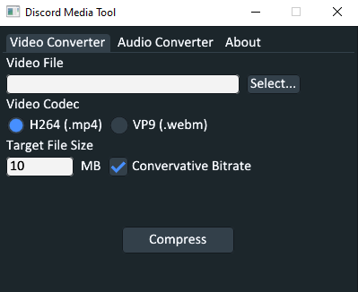

# Discord Media Tool

Want to upload videos and clips to Discord? Frustrated with their file size limits? Too poor to afford nitro?
Here's a solution for you!

This is a program written in Go designed to convert and compress media files such as video and audio files for discord to be under a specified size while maximizing quality and being simplistic. The entire process is done on your machine locally so your media files stay as your business.

## Interface


The interface is fairly simple. For most people wanting to compress videos, just select a video file and click compress. 
If you don't understand something, hover over the option and a tool tip should appear.

## Technical choices
### Video Converter
For the video converter you can choose the H264 or VP9 codecs:
 - **H264:** is the default as it has the widest viewing compatibility while maintaining a balance of decent video quality and encoding speed.
 - **VP9:** allows for better video quality over H264 in most cases but doesn't play natively in Discord for iOS devices and takes much longer to encode.

The audio for encoded videos uses the Opus audio codec at 96 kb/s which is good enough where most people can't hear any noticable difference, especially for clips.

### Audio Converter
For the audio converter you can choose between MP3 or Opus codecs:
 - **MP3** is the default as it is ubiquitous, easily recognized as audio, and will play on pretty much anything that has a speaker.
 - **Opus** is a newer and more advanced codec compared to MP3 that can achieve higher perceived quality at the same or even less bitrate.

## How to use:
1. Go to the [releases](https://github.com/Gordon-T/Discord-Media-Tool/releases) and download the latest 
2. Go to [FFmpeg](https://ffmpeg.org/download.html) and download a windows build of FFmpeg
3. Extract the `latest.zip` file and the ffmpeg build files
5. Take the `ffmpeg.exe` and `ffprobe.exe` from the `/bin` folder of the extracted ffmpeg build and place them in the same directory as `DMT.exe` from the extracted `latest.zip`
  
   The resulting file structure should look like:
    ```
    ├──📁DMT Folder
    │  ├──▶️DMT.exe
    │  ├──📄ffmpeg.exe
    │  └──📄ffprobe.exe
    ```
6. Run `DMT.exe`
7. Click "Select..." for either the "Video Converter" or "MP3 Converter" and choose a file using the file explorer prompt
8. Click "Compress"
9. The newly encoded file should be in the same directory as the selected file with `_<video codec>` appended to the file name


## Building
1. Have or install [Go](https://go.dev/doc/install) >= 1.23.5
2. Clone and extract this repository
3. Run `go build -ldflags="-H=windowsgui -s -w" -o .` in the extracted directory
4. `DMT.exe` should be built in the same directory

## Credits
[FFmpeg](https://ffmpeg.org): Does the actual video/audio encoding

[ffmpeg-go](https://github.com/u2takey/ffmpeg-go): FFmpeg bindings in Go

[giu](https://github.com/AllenDang/giu): The gui library used for this project

[dialog](https://github.com/sqweek/dialog): Used for opening the file explorer prompt easily

[beeep](https://github.com/gen2brain/beeep): Used for windows notifications
## License
This project is licensed under the [MIT License](./LICENSE)
